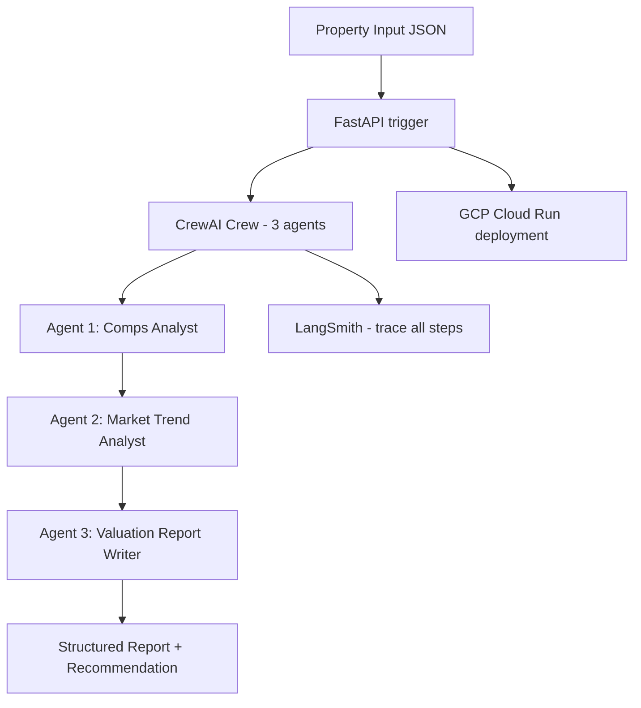

# Project 01 — Real Estate Market Intelligence Agent


## Business Problem
Real estate analysts spend hours manually pulling comparable sales, market trend data, and neighbourhood risk scores to produce property valuation reports. A multi-agent system can automate the full pipeline — pulling comps, analysing market trends, scoring risk, and drafting investor-ready reports in minutes.

## Project Objective
Build a CrewAI 3-agent pipeline:
- **Agent 1 — Comps Analyst:** searches and scores comparable property sales in the target area
- **Agent 2 — Market Trend Analyst:** analyses price trends, days-on-market, supply/demand signals
- **Agent 3 — Valuation Report Writer:** combines comps + trends into a structured valuation report with buy/sell/hold recommendation

Deployed on GCP Cloud Run. All agent runs traced in LangSmith.

## System Architecture


## Folder Structure
```
project-01-real-estate-market-intelligence-agent/
├── app/
│   ├── agents.py           # CrewAI agent definitions
│   ├── tasks.py            # Task definitions with Instructor validation
│   ├── crew.py             # Crew orchestration
│   └── api.py              # FastAPI handler
├── utils/
│   └── cost_tracker.py     # Token budget enforcer
├── evaluation/
│   ├── langsmith_eval.py   # LangSmith eval suite
│   └── test_cases.json     # 10 property test scenarios
├── infra/
│   ├── Dockerfile
│   ├── service.yaml        # GCP Cloud Run service config
│   └── cloudbuild.yaml
├── guardrails/
│   └── __init__.py
├── tests/
│   └── test_agents.py
├── samples/
│   └── sample_property.json
├── langsmith_config.py
├── .github/workflows/deploy.yml
├── .env.example
├── requirements.txt
└── README.md
```

## Setup
```bash
pip install -r requirements.txt
cp .env.example .env
uvicorn app.api:app --reload

# Deploy to GCP Cloud Run
gcloud builds submit --config infra/cloudbuild.yaml
```

## Observability
- **LangSmith:** every CrewAI agent step is traced. View at smith.langchain.com
- **Cost tracking:** TokenBudget enforces 80K token max per crew run
- Set `LANGCHAIN_TRACING_V2=true` and `LANGCHAIN_API_KEY` in .env

## Key Concepts
- CrewAI multi-agent orchestration with role/goal/backstory
- Instructor-validated Pydantic output schemas per agent
- GCP Cloud Run serverless deployment with cloudbuild CI/CD
- LangSmith tracing for multi-agent observability

## Interview Talking Points
1. How do agents pass context between each other in CrewAI?
2. How would you handle real-time MLS data integration?
3. What guardrails prevent hallucinated comps or fake valuations?
4. How would you evaluate valuation accuracy at scale?
5. Why Cloud Run over Cloud Functions for this workload?

## Time Estimate
| Mode | Time |
|---|---|
| Self-paced | 18–24 hours |
| Instructor-guided | 10–14 hours |

---

## Step-by-Step Implementation Guide

### Step 1: Project Setup

```bash
mkdir project-01-real-estate-market-intelligence-agent
cd project-01-real-estate-market-intelligence-agent
python -m venv venv && source venv/bin/activate
mkdir -p app utils evaluation infra tests samples guardrails
```

Install dependencies:
```bash
pip install -r requirements.txt
```

### Step 2: Understand the Multi-Agent Architecture

```
Property input (address, beds, baths, sqft, asking price)
       ↓
Agent 1: Comps Analyst        ← finds 5 comparable recent sales, scores similarity
       ↓
Agent 2: Market Trend Analyst ← analyses 90-day price trend, DOM, absorption rate
       ↓
Agent 3: Valuation Report Writer ← produces final valuation with confidence band + recommendation
       ↓
FastAPI response + LangSmith trace
```

### Step 3: Build the Agents (`app/agents.py`)
See `app/agents.py` for full implementation.

### Step 4: Define Tasks with Instructor Validation (`app/tasks.py`)
See `app/tasks.py` for full implementation.

### Step 5: Wire the Crew (`app/crew.py`)
See `app/crew.py` for full implementation.

### Step 6: Expose via FastAPI (`app/api.py`)
See `app/api.py` for full implementation.

### Step 7: Add Cost Tracking (`utils/cost_tracker.py`)
See `utils/cost_tracker.py` for full implementation.

### Step 8: Deploy to GCP Cloud Run
```bash
gcloud auth login
gcloud config set project YOUR_PROJECT_ID
gcloud builds submit --config infra/cloudbuild.yaml
```
